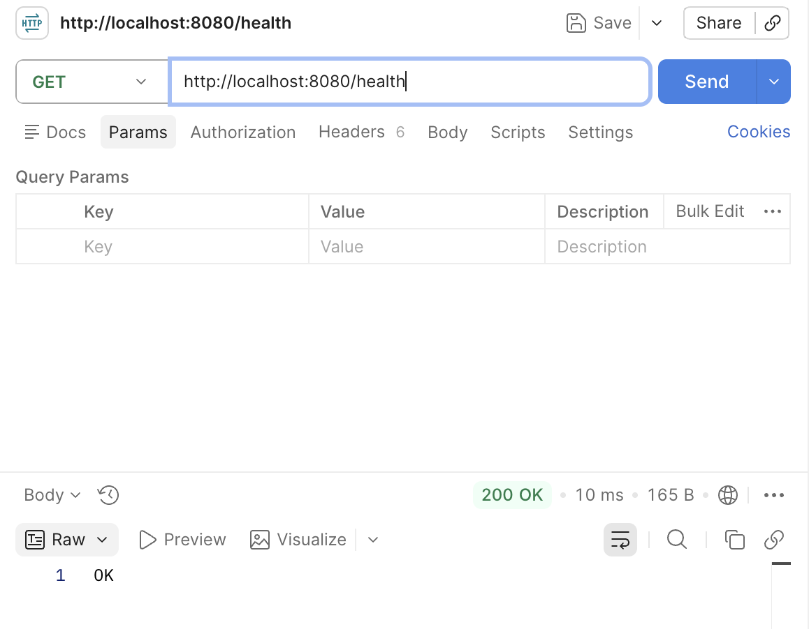

# 15주차 - Spring Boot 시작하기 과제

## Health Check API

`GET /health` 요청을 통해 서버가 정상 동작 중인지 확인할 수 있는 간단한 API

### 코드

```java
@RestController
public class HealthCheckController {

    @GetMapping("/health")
    public ResponseEntity<String> healthCheck() {
        return ResponseEntity.ok("OK");
    }
}
```

### Postman 테스트 결과

